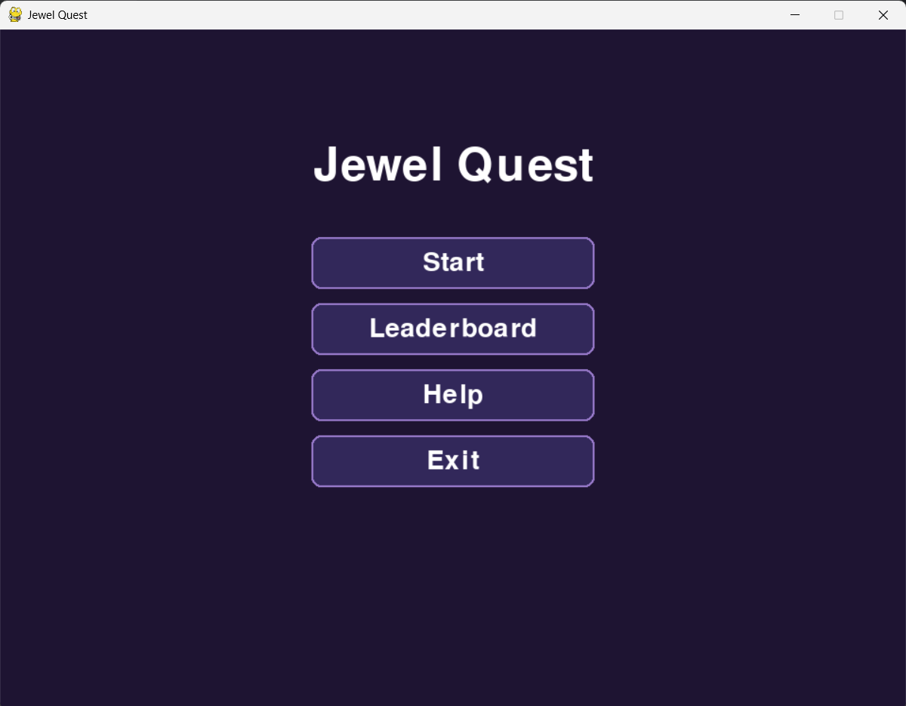
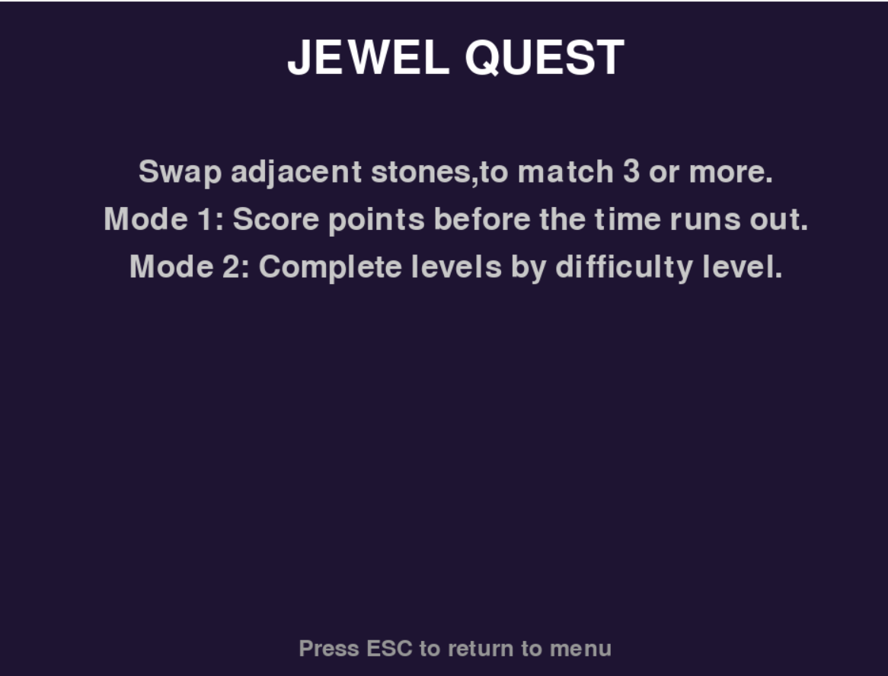
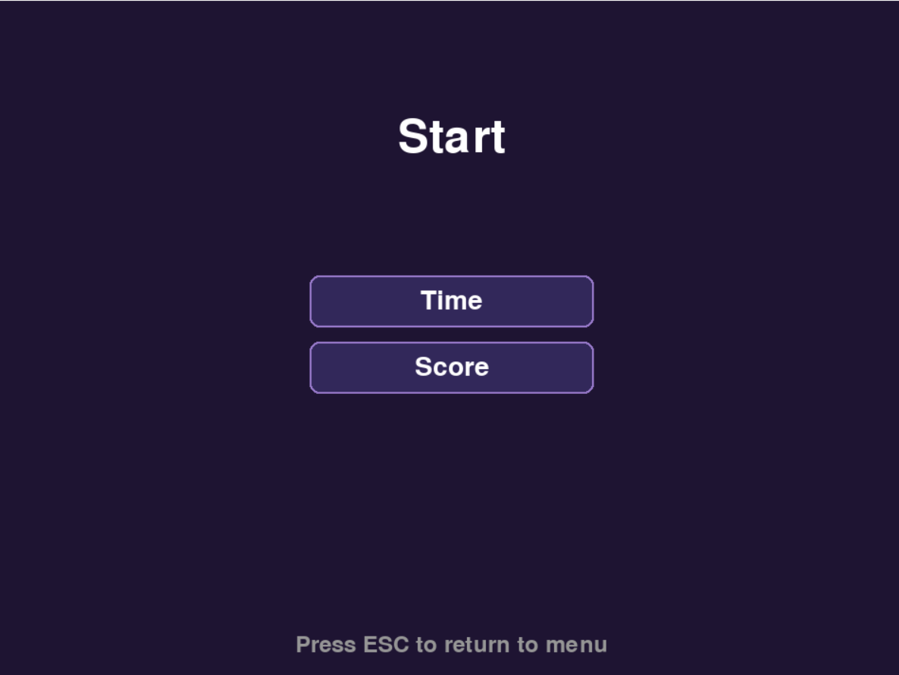
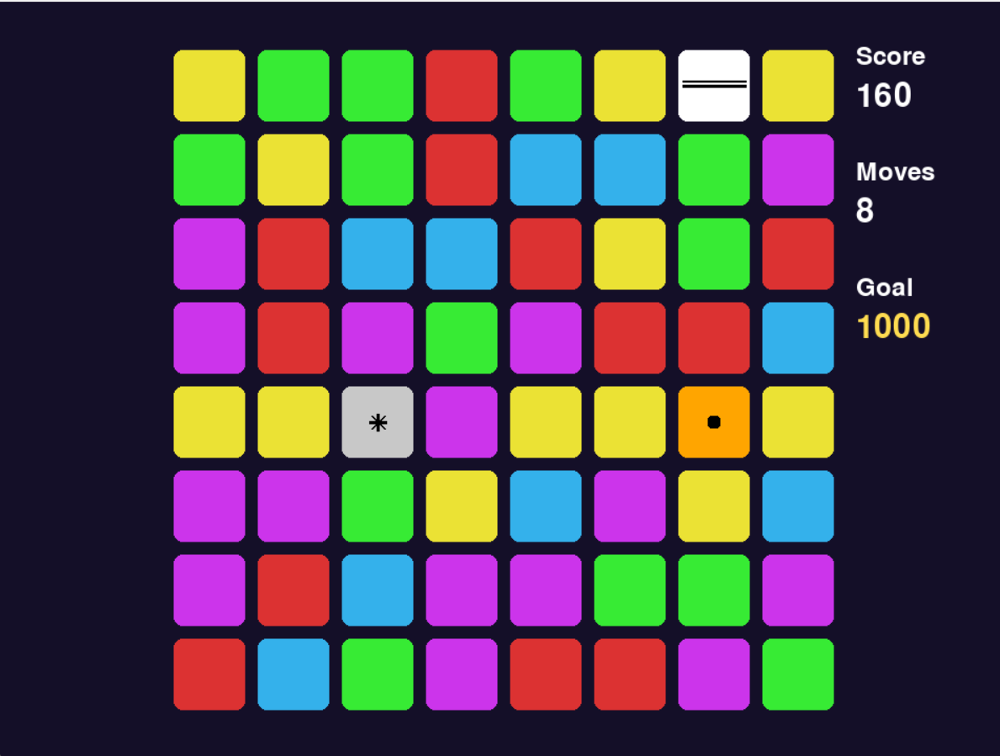
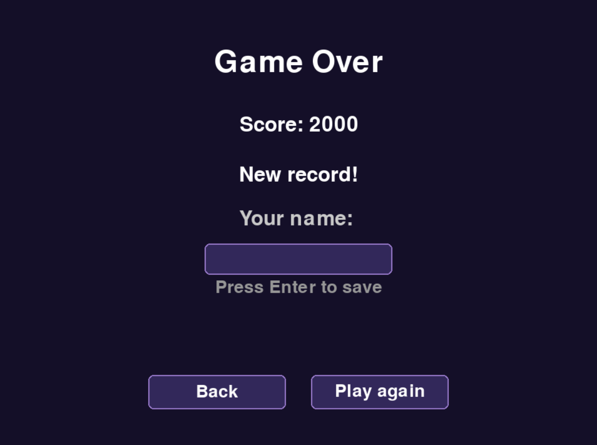
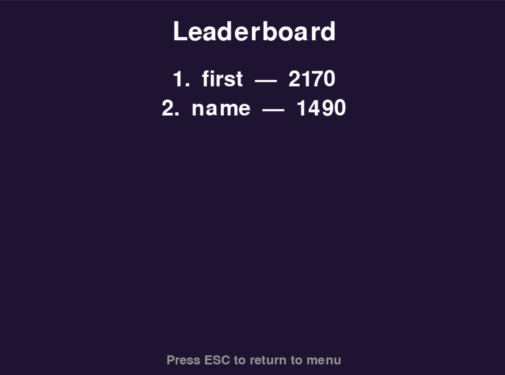

# Jewel Quest game

## Technologies used:
### pygame

## Menu:

## Help:

## Mode select:

## Gameplay:

Swap jewels to get 3 or more in a row. Each jewel is 10 points per delete.
### Bomb:

Removes all the jewels around it

### Line:

Removes all the jewels in a row

### Color:

Removes all the jewels that have the same color

## Record

If your score is more than first leaderboard place, the game will show a special dialog.

## Leaderboard

