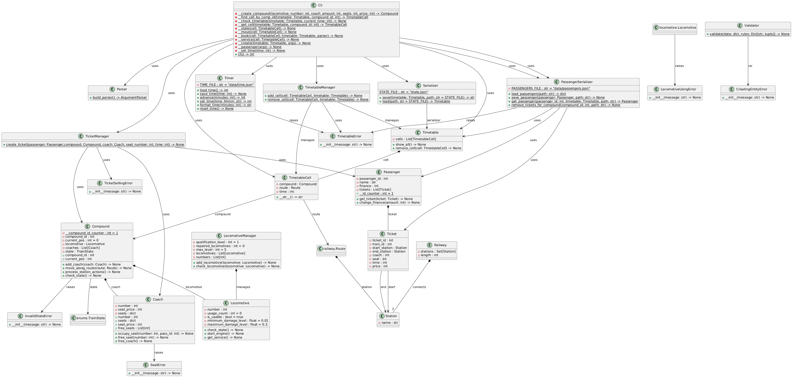
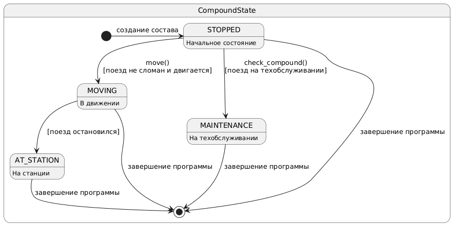

## Лабораторная работа №1

### Вариант 45

Предметная область: движение поездов по железнодорожным путям.

Важные сущности: поезд, локомотив, вагоны, железнодорожные пути, станция, билет, расписание.

Операции: операция движения по маршруту, операция посадки и высадки пассажиров, операция технического обслуживания, 
операция поддержания безопасности, операция обеспечения расписания.

## Краткое описание программы
Программа представляет собой модель железной дороги с возможностями управления поездами, техобслуживания,
бронирования мест, обеспечение корректного расписания и движения по заданному маршруту

Управление системой осуществляется через интерфейс командной строки. Состояние системы можно сохранять 
в JSON-файл и загружать из него.

### Интерфейс командной строки
Команды вводятся в виде текстовых инструкций. Программа поддерживает создание составов, управление их движением,
бронирование мест и мониторинг состояния.

### 🔹 Основные команды

| Команда   | Аргументы                 | Действие                                                                                             |
|-----------|---------------------------|------------------------------------------------------------------------------------------------------|
| create    | loco_number coach_amount  | Создает новый состав с указанными локомотивом и вагонами                                             |
| state     | compound_id               | Отображает текущее состояние указанного состава                                                      |
| book      | coach  seat   pass_id | Бронирует место в указанном вагоне для пассажира                                                     |
| service   | compound_id               | Выполняет техническое обслуживание локомотива                                                        |
| timetable | -                         | Управляет расписанием: добавляет или отображает записи                                               |
| passenger | name finance          | Создает пассажира с заданными именем и средствами                                                    |
| tick      | -                         | Команда для симуляции промежутка времени (30 минут) и управления расписанием и движением поездов |
| settime   | time                      | Устанавливает время в минутах после полуночи                                                         |
| settime   | time                      | Устанавливает время в минутах после полуночи                                                         |
| now       | -                         | Отображает текущее время                                                                             |
| exit      | -                         | Завершает работу программы и сохраняет данные(за исключением времени)                                |

## Диаграмма классов
Диаграмма классов отражает иерархию наследования, композицию и агрегацию между основными компонентами системы.
Диаграмма классов данной программы представлена ниже

### Ключевые классы:
- `Coach` – вагон с местами и ценой за место
- `Locomotive` – локомотив с системой контроля работоспособности
- `Compound` –состав как объединение локомотива и вагонов
- `Passenger` – пассажир с финансовыми средствами и билетами
- `Ticket` – билет на поезд с указанием маршрута и места
- `Station` – железнодорожная станция
- `Railway` – участок пути между двумя станциями
- `Route`  – маршрут из последовательных участков пути
- `TimetableCell` – ячейка расписания с привязкой к времени
- `Timetable` - полное расписание движения составов
- `TimetableManager` - менеджер управления расписанием
- `Serializer` - сериализация и восстановление состояния системы
- `PassengerSerializer` – управление записью пассажиров в файл и управлене их данными
- `Validator` - валидация входных данных
- `LocomotiveManager` - управление техническим обслуживанием локомотивов
- `TicketManager` - система бронирования билетов
- `Timer` – симуляция времени; хранит текущее время в минутах, поддерживает продвижение, установку и форматирование
- `Parser` – построение CLI-парсера с описанием всех доступных команд и их аргументов
- `Cli` – точка входа в приложение; обрабатывает команды, координирует взаимодействие всех компонентов системы
## Диаграмма состояний
Диаграмма описывает жизненный цикл системы – возможные состояния и переходы между ними.
Описание состояний описано на диаграмме:

### Состояния:
- `STOPPED` – начальное состояние после создания состава
- `MOVING` – состав в движении
- `AT_STATION` – нахождение на станции, операция посадки и высадки пассажиров
- `MAINTENANCE` – на техническом обслуживании