# Лабораторная работа № 2
## Вариант 9
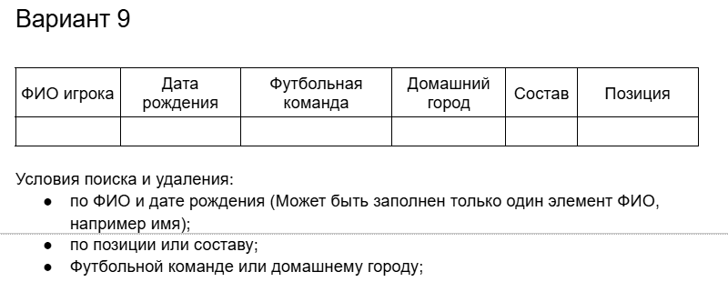

### При разработке были использованы технологии SQLAlchemy в связке с SQLite, а также PyQt 6.10.2
## Возможности программы
При запуске программы пользователю предоставляется главное окно с записями. По умолчанию записи читаются из .db-файла:

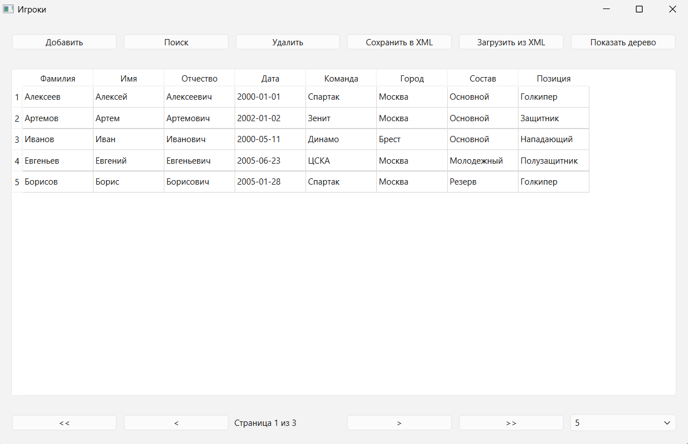
### Работа с XML
Также возможна загрузка из XML-файла и сохранение в XML-файл данных:
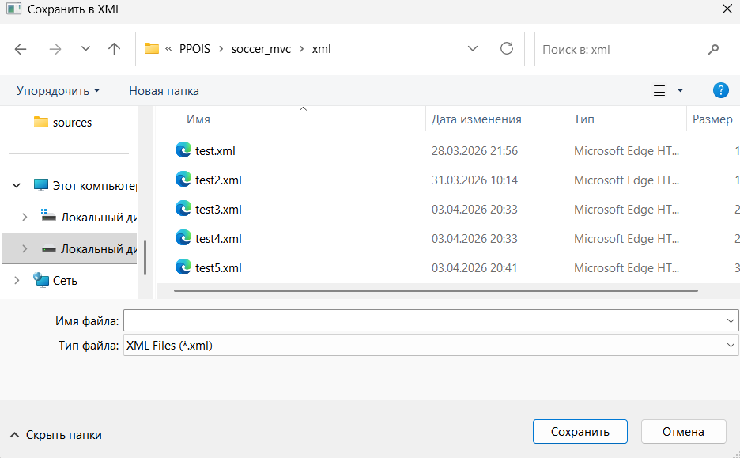

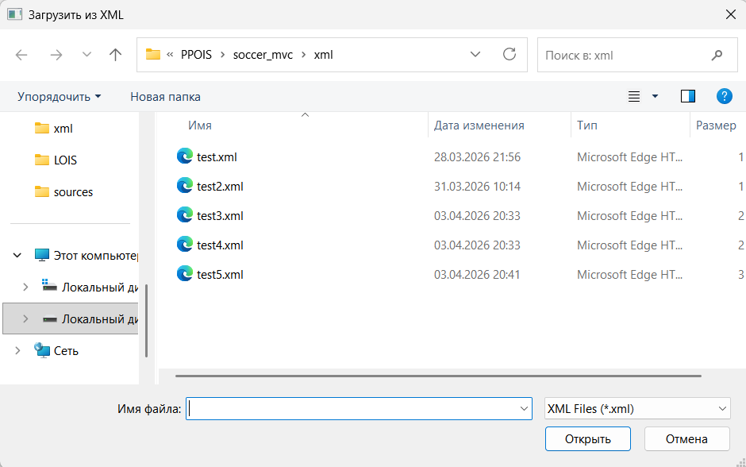

### Добавление игроков 
При нажатии на кнопку **_"Добавить"_** вызовется дочерний диалог, предлагающий ввод полей:

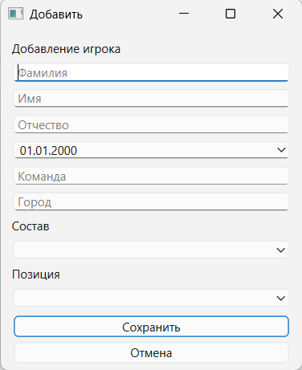

Если не будут заполнены все необходимые поля, программа выдаст ошибку:

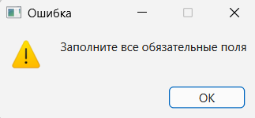

### Поиск игроков
При нажатии на кнопку **_"Поиск"_** вызовется дочерний диалог, предлагающий поиск по трем условиям:

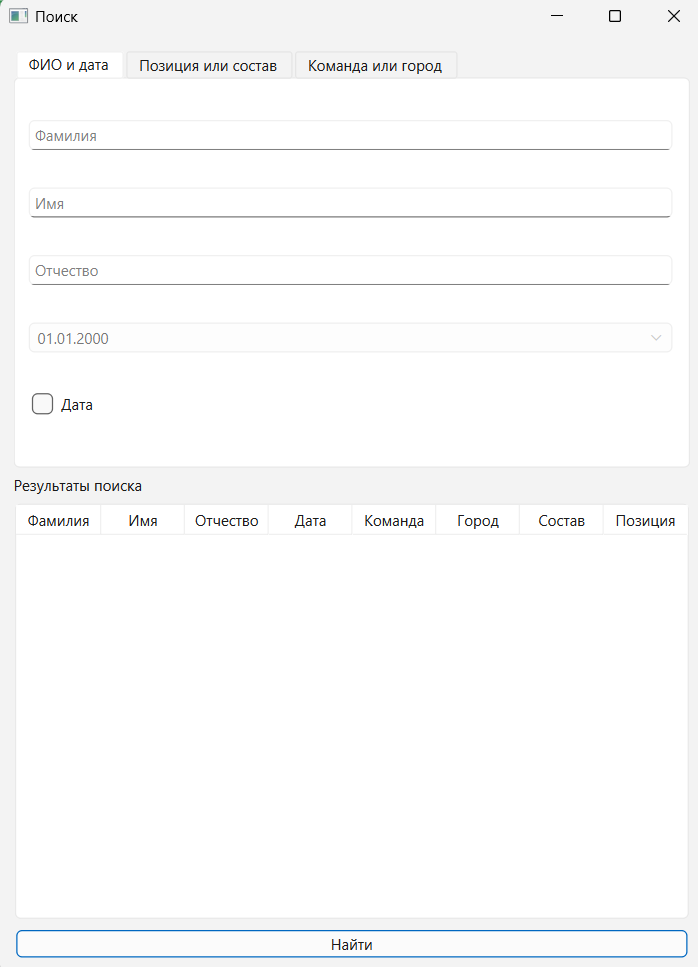

Если не будут заполнены все обязательные поля:

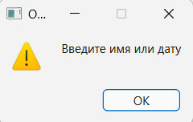

Иначе выведутся результаты поиска:

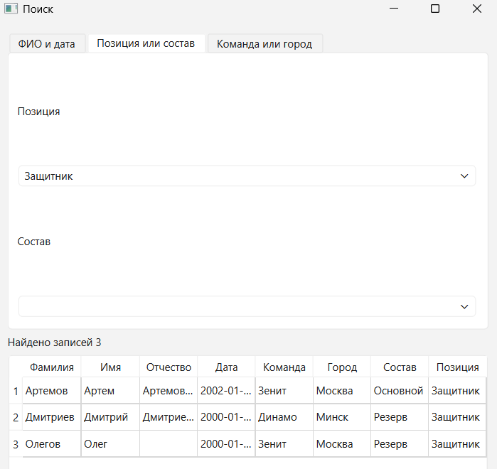

### Удаление игроков

Удаление игроков происходит в отдельном дочернем диалоге:

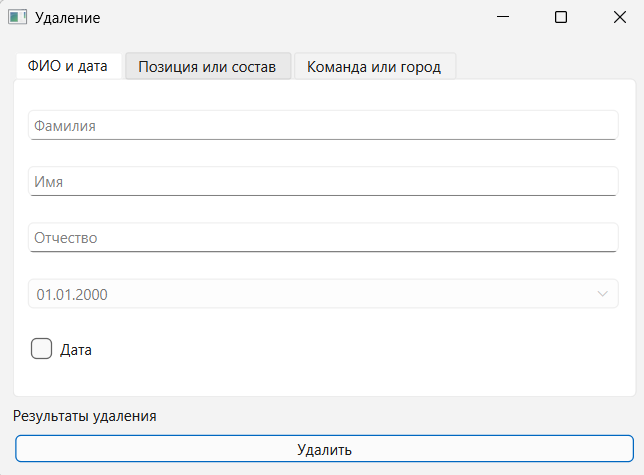

### Элементы управления
Панель снизу позволяет редактировать количество записей на странице путем выбора из предложенных:
Также доступен переход на следующую, предыдущую, первую и последнюю страницы:

### Дерево записей

При нажатии на кнопку _**"Показать дерево"**_ будет показано дерево записей игроков, а
сама кнопка сменится на _**"Показать таблицу"**_:
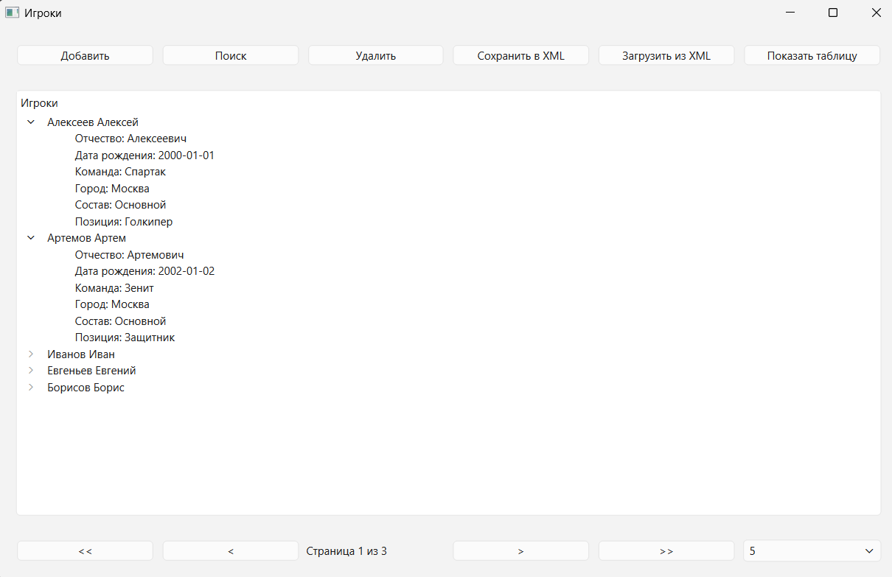

## Вывод 
В результате выполнения лабораторной работы была разработана программа с графическим
пользовательским интерфейсом, базой данных и работой с xml файлами.